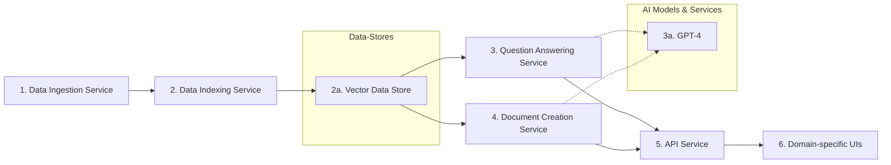
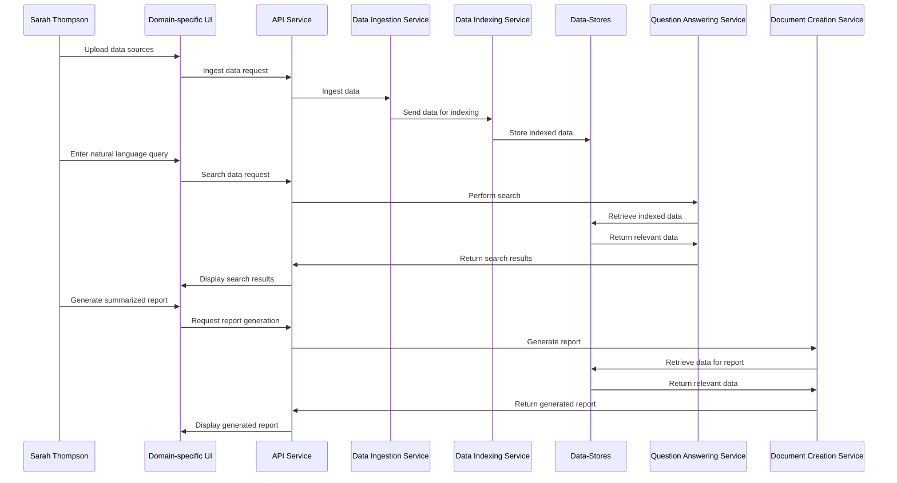
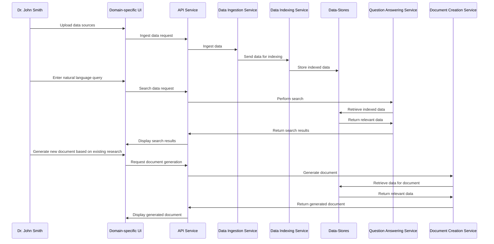
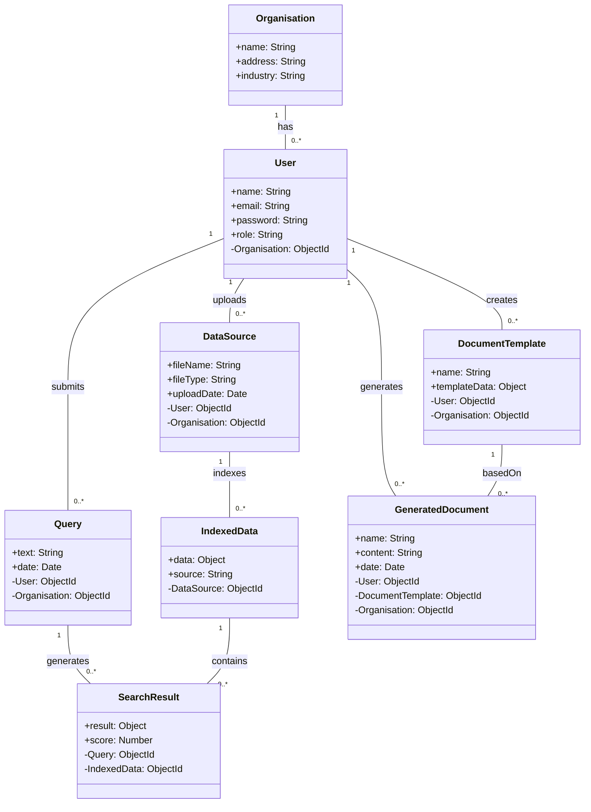

## Table of Contents
- [Table of Contents](#table-of-contents)
- [Project Overview](#project-overview)
  - [Objectives](#objectives)
  - [Target Audience/Users](#target-audienceusers)
  - [Constraints and Assumptions](#constraints-and-assumptions)
- [Problem Statement](#problem-statement)
  - [Problem Description](#problem-description)
  - [Existing Solutions](#existing-solutions)
  - [Proposed Solution](#proposed-solution)
- [MVP Scope](#mvp-scope)
  - [Feature List](#feature-list)
  - [In-Scope Features](#in-scope-features)
  - [Out-of-Scope Features (for future development)](#out-of-scope-features-for-future-development)
- [Important Concepts](#important-concepts)
  - [Third-Party AI Models](#third-party-ai-models)
    - [GPT-4](#gpt-4)
    - [HuggingFace](#huggingface)
  - [Vector DB ("searching by meaning")](#vector-db-searching-by-meaning)
  - [Langchain](#langchain)
    - [Components](#components)
- [System Outline](#system-outline)
- [User Personas](#user-personas)
- [User Stories](#user-stories)
- [Interaction Flow Diagrams](#interaction-flow-diagrams)
  - [Interaction Flow Diagram 1](#interaction-flow-diagram-1)
  - [Interaction Flow Diagram 2](#interaction-flow-diagram-2)
- [Data Model Definition](#data-model-definition)
  - [Class Diagram](#class-diagram)
- [Open API Spec](#open-api-spec)
- [Infrastructure Design](#infrastructure-design)
  - [High-level Infrastructure Diagrams](#high-level-infrastructure-diagrams)
    - [Solution 1](#solution-1)
    - [Solution 2](#solution-2)
- [Detailed Project Plan \& Timeline](#detailed-project-plan--timeline)

---

## Project Overview

_What we are trying to do and why._
### Objectives
### Target Audience/Users
### Constraints and Assumptions

---

## Problem Statement

_What is the problem we are trying to solve._
### Problem Description
### Existing Solutions
### Proposed Solution

---
## MVP Scope

_What will we do now and what won't we do._
### Feature List
### In-Scope Features
### Out-of-Scope Features (for future development)

---

## Important Concepts

_Tools and methodologies we will use._

### Third-Party AI Models
#### [GPT-4](openai.com/blog/gpt-4/)
#### [HuggingFace](https://huggingface.co/)
### Vector DB ("searching by meaning")

### [Langchain](https://python.langchain.com/en/latest/index.html)
LangChain is a framework for developing applications powered by language models.  It is designed with the following principles in mind:

* Be data-aware: connect a language model to other sources of data
* Be Agentic: allow a language model to interact with its environment

#### Components
* Chains
* Prompt templates
* llms
* indexing utils
* tools
* agents
* memory

---

## System Outline

_A brief description of the system, its purpose, goals, and key components._

---

## User Personas

_A detailed description of each user persona, their needs, and expectations._

**Persona 1:**

- _Name:_ Sarah Thompson
- _Role:_ Market Research Analyst
- _Goals:_
  - Discover relevant information and trends from large volumes of industry reports and news articles.
  - Efficiently create summarized reports to share with her team.
  - Stay up-to-date with market developments and competitors' activities.
- _Challenges:_
  - Manually searching and extracting data from numerous sources is time-consuming.
  - Ensuring data accuracy and relevance in her reports.
  - Keeping track of information from various sources and formats.

**Persona 2:**

- _Name:_ Dr. John Smith
- _Role:_ Pharmaceutical Research Scientist
- _Goals:_
  - Quickly access and extract relevant information from medical journals and clinical trial data.
  - Generate new documents based on existing research, adapting them to novel hypotheses or drug targets.
  - Stay informed about recent advancements and discoveries in his field.
- _Challenges:_
  - Sifting through vast amounts of scientific literature and data to find pertinent information.
  - Generating documents that follow the structure and style of established research papers.
  - Balancing research efforts with staying current on new developments in his domain.

---

## User Stories

_A collection of user stories describing how users will interact with the system to accomplish specific tasks._

**User Stories for Persona 1 (Sarah Thompson, Market Research Analyst):**

1. _As a market research analyst, I want to easily upload and ingest structured and unstructured data sources so that I can have all relevant information in one place._
2. _As a market research analyst, I want to search for information using natural language queries so that I can quickly find relevant data from multiple sources._
3. _As a market research analyst, I want to utilize AI-enhanced search results so that I can get more accurate and relevant information._
4. _As a market research analyst, I want to generate summarized reports based on extracted data so that I can efficiently share insights with my team._
5. _As a market research analyst, I want to access a domain-specific user interface so that I can perform data-driven tasks quickly and efficiently._

**User Stories for Persona 2 (Dr. John Smith, Pharmaceutical Research Scientist):**

6. _As a pharmaceutical research scientist, I want to easily upload and ingest structured and unstructured data sources so that I can have all relevant scientific literature and clinical trial data in one place._
7. _As a pharmaceutical research scientist, I want to search for information using natural language queries so that I can quickly find pertinent information from multiple sources._
8. _As a pharmaceutical research scientist, I want to utilize AI-enhanced search results so that I can get more accurate and relevant information._
9. _As a pharmaceutical research scientist, I want to generate new documents based on existing research, adapting them to novel hypotheses or drug targets so that I can streamline the document creation process._
10. _As a pharmaceutical research scientist, I want to access a domain-specific user interface so that I can perform data-driven tasks quickly and efficiently._

---

## Interaction Flow Diagrams

_A collection of interaction flow diagrams that visually represent different user journeys and their interactions with the system._

### Interaction Flow Diagram 1

### Interaction Flow Diagram 2

---

## Data Model Definition

_A clear definition of the data model, including a Class Diagram._

### Class Diagram

---

## Open API Spec

_A comprehensive specification of all the endpoints in the system._

[Link to Open API Specification document]

---

## Infrastructure Design

_High-level infrastructure diagrams for each proposed solution._

### High-level Infrastructure Diagrams

#### Solution 1

#### Solution 2

[... additional infrastructure diagrams ...]

---

## Detailed Project Plan & Timeline

_A complete project plan with a detailed timeline for the implementation of the system._

[Link to Project Plan document]